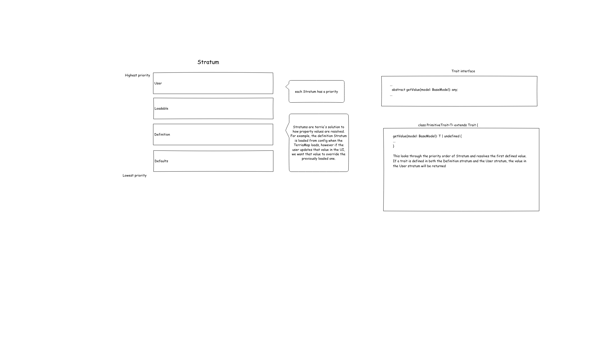
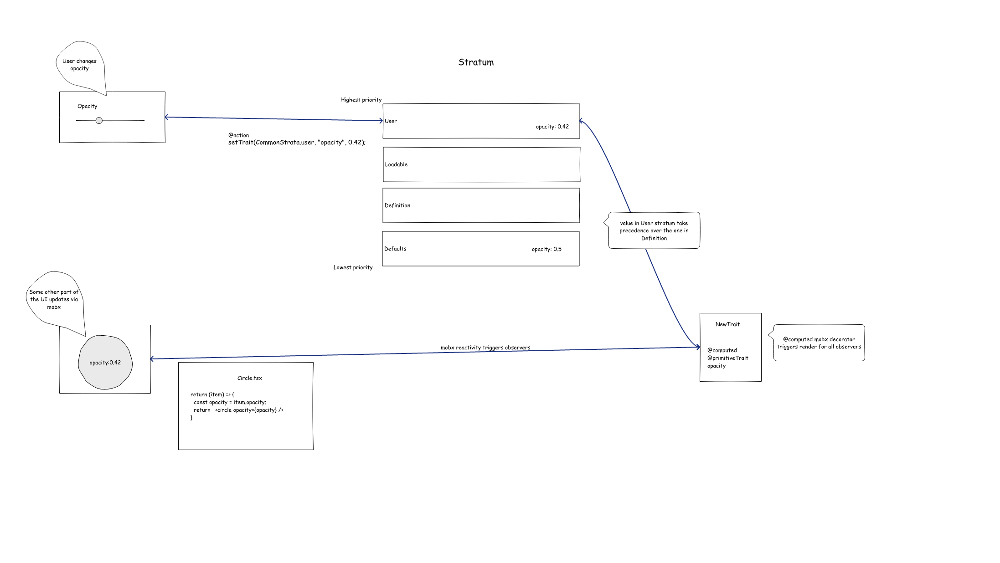

# Traits in Depth

The Traits system is Terria's way of managing a priority order for state. For example, we might have a default opacity property from a config file that should be overriden by a user provided value. This article will go through how Traits are made, how the priority system works and how updates happen in the UI.

## Making Traits


For base traits such as `BaseMapsTraits`, we extend ModelTraits. However when composing multiple traits, we use the `mixTraits` function. For example, `ArcGisTerrainCatalogItemTraits` is composed out of `UrlTraits, MappableTraits, CatalogMemberTraits`.

When creating a new property within a Traits class, we use [decorators](https://babeljs.io/docs/en/babel-plugin-proposal-decorators) to ensure that the field takes part in the Traits system.

## Stratum order model


Stratums are how Terria determines which value a Trait should resolve to.

## Strata types

There are 4 strata types

-   Defaults
-   Loadable
-   Definition
-   User

Each type can have multiple strata - see [`StratumOrder.ts`](/lib/Models/Definition/StratumOrder.ts)

## Common strata

There are 5 common strata - these exist for every model

-   Defaults
    -   `default`
-   Definition
    -   `underride`
    -   `definition`
    -   `override`
-   User
    -   `user`

### Defaults `defaults`

This is the lowest priority stratum best thought of as a sensible fallback value. For example `opacity` (in [`OpacityTraits.ts`](/lib/Traits/TraitsClasses/OpacityTraits.ts))

```ts
@primitiveTrait({
  type: "number",
  name: "Opacity",
  description: "The opacity of the map layers."
})
opacity: number = 0.8;
```

These should only be used in Trait definitions.

### Definition `underride`

`underride` values can be used to "override" the `default` stratum values - but not `definition` values. It can be thought of setting a new "default" value for a `Trait` - as `default` stratum shouldn't be changed.

Some example usages of `underride`

-   Copying `itemPropertiesByIds`, `itemPropertiesByType`, `itemProperties`, to nested groups or nested references - that is, when a group or reference is loaded, if there are nested groups or nested reference - they will get the parent `itemProperties*` set in their `underride` stratum
-   Setting `isExperiencingIssues = true` for models which have configuration issues

### Definition `definition`

Values provided when a model is created. This takes higher priority than `defaults` and `underride`.

#### Use case 1 - Init file

Values from [initialization files](https://github.com/TerriaJS/terriajs/blob/main/doc/customizing/initialization-files.md). For example a WMS item with `opacity = 1`.

```json
{
"catalog": [
    {
      "type": "wms",
      "name": "A WMS layer",
      "url": "some-wms-server.com/layer",
      "opacity": 1
    },
    ...
  ],
  ...
}
```

#### Use case 2 - Dynamic groups

Values for models created programmatically by dynamic groups - for example `WebMapServiceCatalogGroup` or `CkanCatalogGroup`...

### Definition `override`

`override` values can be used to "override" the `definition` stratum values (and lower level strata).

Some use cases:

-   To override invalid `definition` values
-   Apply `itemProperties` to a model

### User `user`

This is the highest priority stratum - it represents user-driven values. This strata should only be used for values changed by user-interaction (for example the `opacity` slider)

## Loadable strata

Loadable strata sit between the `defaults` and `definition` strata. It represents values which are loaded from external sources - for example WMS `GetCapabilities`.

`WebMapServiceCatalogItem` uses the loadable stratum `WebMapServiceCapabilitiesStratum` to set configuration from the WMS server's `GetCapabilities`.

This includes `layers`, `styles`, `legends`, ...

This means that we aren't required define all this configuration manually in `definition` (eg init files) - as sensible values can be computed based on `GetCapabilities`. But, as Loadable strata sites below `definition`, we can "override" these values by setting values in `definition`.

It is important to note that there are many Loadable strata - and models can have multiple.

## What happens at runtime



To start, let's assume that we have an `opacity` trait with a value of 0.5 loaded through configuration. As it is loaded through configuration, it is placed within the `Definition` stratum.

When a user interacts with an opacity slider and sets its new value to 0.42, `setTrait(CommonStrat.user, "opacity", 0.42)` is invoked within an [action](https://www.mobxjs.com/refguide/action.html). This triggers the [computed](https://www.mobxjs.com/refguide/computed-decorator.html) value to be recalculated and the new value of `0.42` is picked up as the value in the User stratum has a higher priority than the Definition stratum.

As the computed value is updated, other parts of the UI that observe that value are automatically rendered again reflecting the updated value.

## Strata examples

See [doc/contributing/strata-examples.md](./strata-examples.md)
